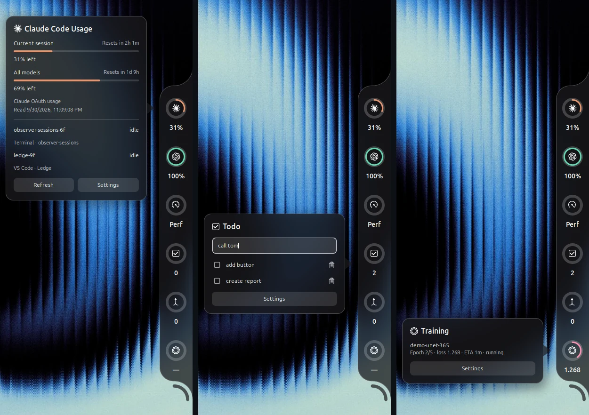
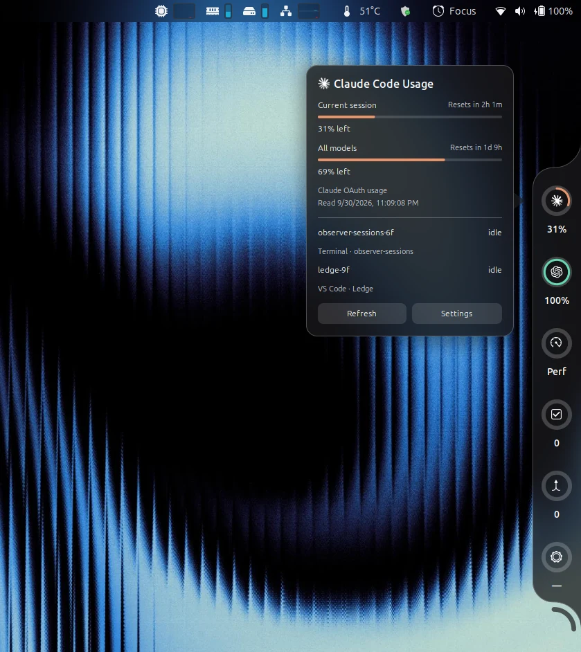
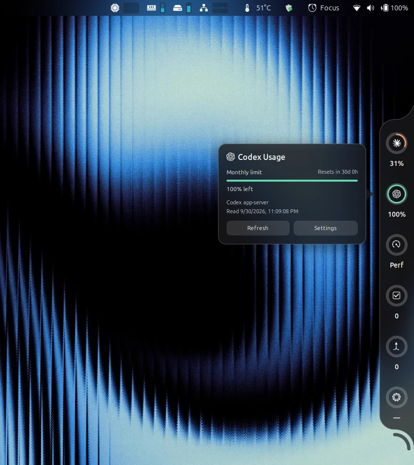
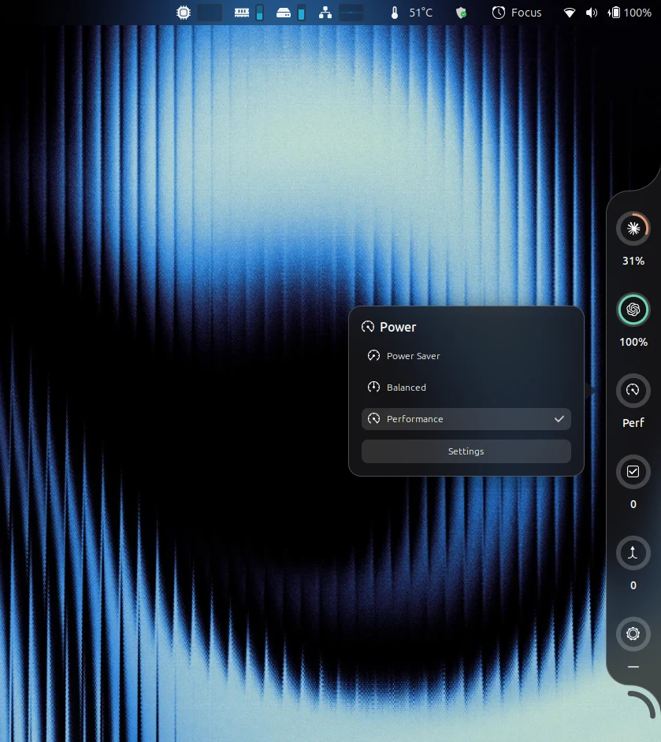
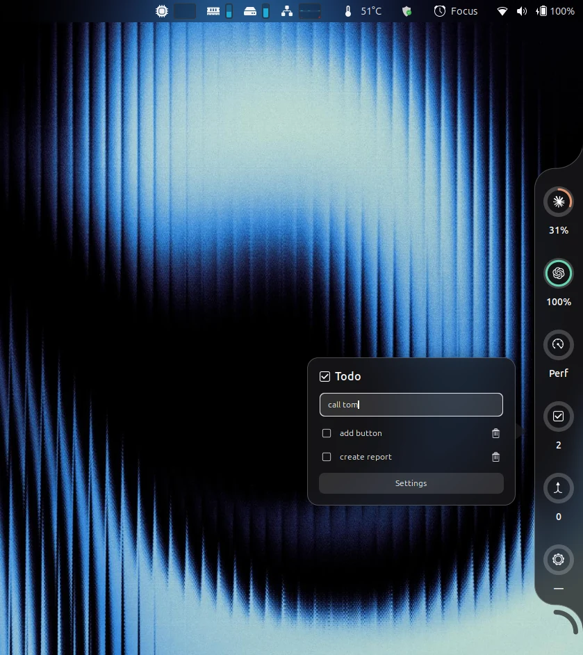
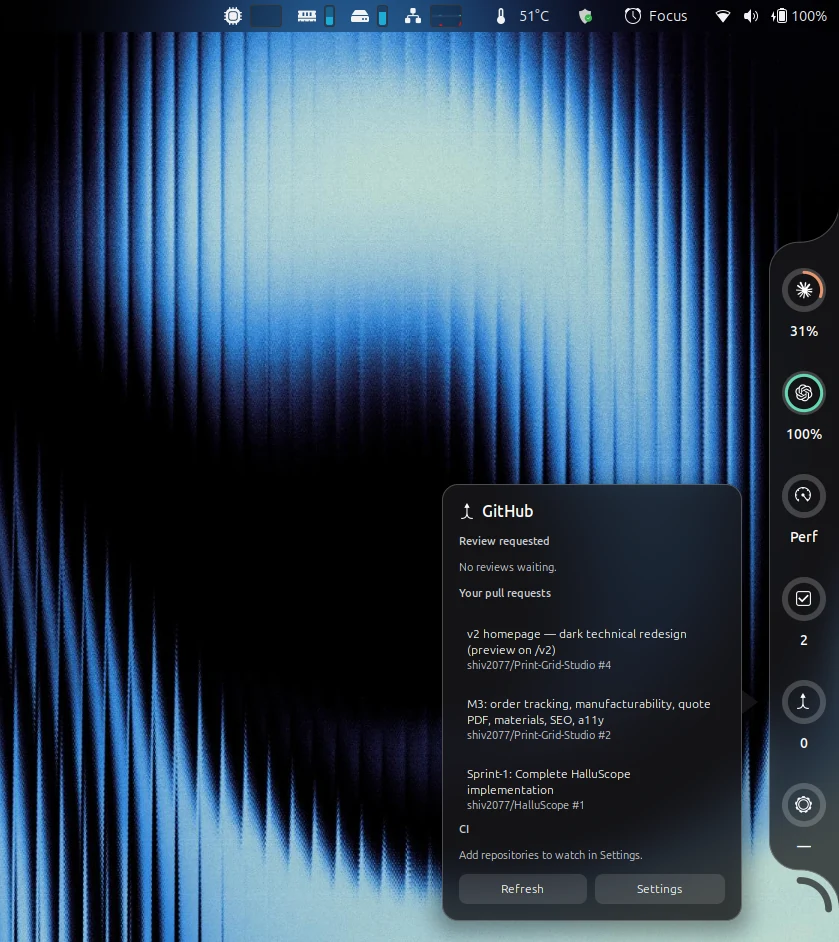
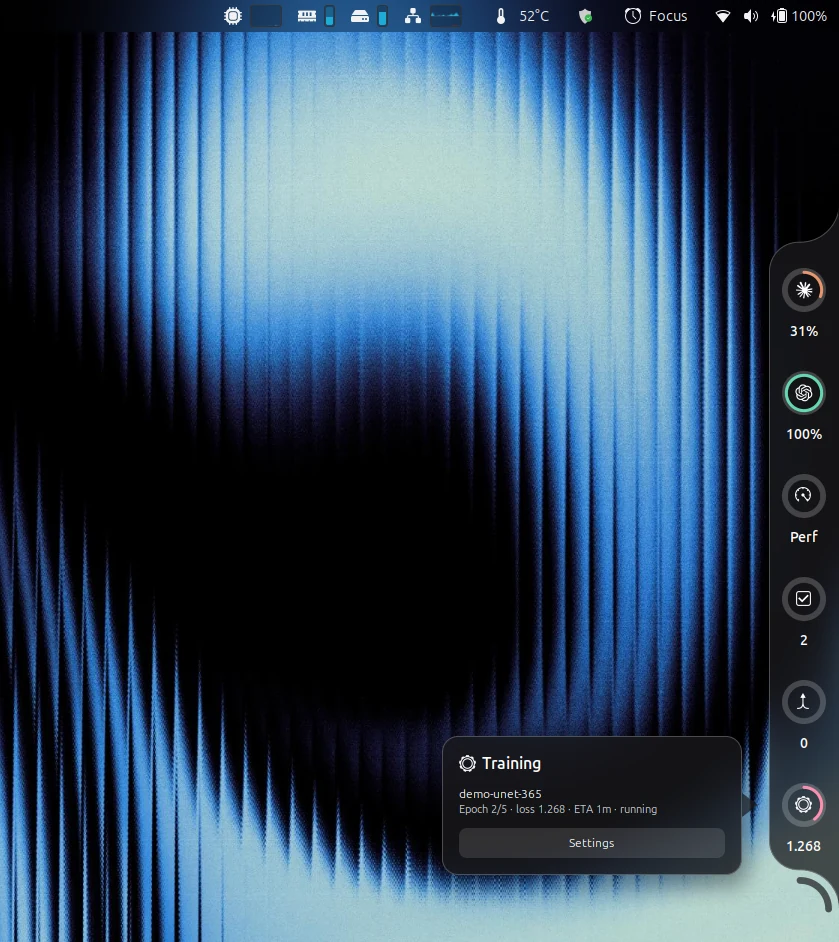

<div align="center">

# Ledge

**A screen-edge notch for GNOME Shell that keeps the things you check all day one glance away.**




</div>

Ledge docks a slim pill on any edge of your screen. Hover it and it unfolds into a column of rings, one per widget: coding assistant limits, power profile, todos, local models, GitHub and training runs. Hover or click a ring for its card. Everything runs locally, asynchronously and without accounts of its own.

## Contents

- [Highlights](#highlights)
- [Widgets](#widgets)
- [Appearance](#appearance)
- [Installation](#installation)
- [Usage](#usage)
- [Reporting training runs](#reporting-training-runs)
- [Privacy and security](#privacy-and-security)
- [How it works](#how-it-works)
- [Development](#development)
- [Troubleshooting](#troubleshooting)
- [Uninstalling](#uninstalling)
- [License](#license)

## Highlights

- **Eight widgets, one notch.** Each is a self-contained module with its own switch. A switched-off widget does no reads and no polling, and the notch shortens to fit.
- **Never blocks the desktop.** Every file read, subprocess and HTTP request is asynchronous with a timeout. A slow or missing data source shows a clear state in its card instead of freezing the shell.
- **Keyboard first.** Super+Shift+L opens and focuses the notch, Tab walks every control, Escape closes it. Text entry works on Wayland.
- **Themes, including real frosted glass.** Eleven themes, each checked for readable contrast. The glass themes blur what is behind the notch, clipped to its exact outline.
- **Local by design.** No telemetry, no tokens stored. GitHub goes through the `gh` CLI; model servers are reached on localhost only.

## Widgets

<table>
<tr>
<td width="50%"></td>
<td width="50%"></td>
</tr>
<tr>
<td><b>Coding usage.</b> Claude Code, Cursor and Codex limits as rings, with every limit window, reset times and live session activity in the card.</td>
<td>Rings show quota left. A dash means no reading and never stands in for 0%. Dimmed rings mark stale readings.</td>
</tr>
<tr>
<td></td>
<td></td>
</tr>
<tr>
<td><b>Power.</b> The current power-profiles-daemon profile. Click a profile to switch; changes made in Quick Settings show up immediately.</td>
<td><b>Todo.</b> Type and press Enter to add, tick to complete, delete with the bin. Completed items sink to the bottom.</td>
</tr>
<tr>
<td></td>
<td></td>
</tr>
<tr>
<td><b>GitHub.</b> Review requests, your open pull requests and the latest CI run for repositories you watch. The ring turns red when a completed run fails.</td>
<td><b>Training.</b> Live epoch progress with the loss as the label, plus notifications when a run finishes, crashes or stalls.</td>
</tr>
</table>

| Widget | Cell | Card | Source |
| --- | --- | --- | --- |
| Claude Code, Cursor, Codex | Quota left in the current window | Limit windows, reset times, sessions | Each tool's existing sign-in |
| Power | Active profile | Power Saver, Balanced, Performance | power-profiles-daemon over D-Bus |
| Todo | Open items | Add, complete, delete | `~/.local/share/ledge/todos.json` |
| Local models | Loaded models; ring is GPU memory in use | Size, VRAM and a tokens-per-second test per model | Ollama and LM Studio on localhost, `nvidia-smi` |
| GitHub | Review requests; red on failing CI | Pull requests and CI, click to open | `gh` CLI |
| Training | Active run's progress and loss | Recent runs with epoch, loss, ETA and state | `~/.local/share/ledge/runs/` |

## Appearance

Themes live in the Appearance section at the top of the preferences, each shown with a color swatch. Changes apply instantly, including to an open card.

| Theme | Description |
| --- | --- |
| **Midnight** | Pure black. The default. |
| **Graphite** | Soft dark grey. |
| **Nord**, **Catppuccin Mocha**, **Dracula** | The well-known palettes. |
| **Ocean** | Deep navy. |
| **Snow** | Clean light theme. |
| **Frosted Dark**, **Frosted Light** | Glass: a live blur of whatever is behind the notch and cards, with a tint, a bright rim and a soft shadow. Adjustable blur, tint and brightness. |
| **System** | Follows Ubuntu's light or dark style and your Yaru accent color, live. |
| **Custom** | Your own notch, card, text and highlight colors, with background opacity. |

Every theme keeps text at WCAG AA contrast or better. This is enforced by tests for the built-in themes and at runtime for System and Custom. Provider and widget colors stay the same in every theme; where one would be hard to see, only its lightness changes. The glass blur is clipped to the notch's exact shape, curls and rounded corners included, and works alongside Blur My Shell.

## Installation

**Requirements:** Ubuntu 24.04 with GNOME Shell 46, Python 3 and `glib-compile-schemas`, which ship with Ubuntu Desktop. Optional: `gh` for the GitHub widget, Ollama or LM Studio for the models widget.

```sh
git clone https://github.com/shiv2077/Ledge.git
cd Ledge
make install
```

Log out and back in (Wayland only discovers new extensions at login), then:

```sh
gnome-extensions enable ledge@shiv2077
gnome-extensions prefs ledge@shiv2077
```

The installer backs up any previous install under `~/.local/share/ledge/backups/`. To build a shareable zip, run `make package`; it writes `dist/ledge@shiv2077.shell-extension.zip`.

## Usage

| Action | How |
| --- | --- |
| Unfold the notch | Hover the pill on the screen edge |
| Open a card | Hover or click a ring |
| Keyboard | **Super+Shift+L** opens and focuses the notch, **Tab** moves between controls, **Escape** closes |
| Add a todo | Click the todo ring, type, press **Enter** |
| Settings | Hover the curve below the notch for the gear, or use **Settings** in any card |
| Preview without accounts | Turn on **Demo readings** in preferences |

Preferences have one group per widget: an on/off switch plus that widget's settings, such as refresh intervals, GitHub repositories to watch (`owner/name`) and the training stall timeout. Placement options choose the screen edge, the monitor and whether the notch stays expanded. With every widget enabled, a side-edge notch is about 910 px tall; on smaller screens, switch a few off or dock it to the top or bottom edge.

## Reporting training runs

Add [`tools/ledge_status.py`](tools/ledge_status.py) to any training script. It has no dependencies beyond the Python standard library.

```python
from ledge_status import RunStatus

with RunStatus("resnet-cifar", total_epochs=10) as status:
    for epoch in range(1, 11):
        for step, batch in enumerate(loader):
            loss = train_step(batch)
            status.update(epoch=epoch, step=step, loss=loss, eta_seconds=eta)
```

The status file is replaced atomically every 10 updates (`every=` changes that). Leaving the block marks the run done; an exception marks it crashed. Outside a `with` block, call `status.done()` or `status.crashed()`. A running job with no update for 10 minutes is shown as stalled and announced once.

To see the widget without a real job, run the included simulator:

```sh
python3 tools/demo_training.py            # a normal run of about a minute
python3 tools/demo_training.py --crash    # crashes halfway
python3 tools/demo_training.py --stall    # stops reporting halfway
```

## Privacy and security

Ledge reaches the network only in these ways:

| Destination | Used by |
| --- | --- |
| Claude, Cursor and Codex usage endpoints | The usage reader, with each tool's existing local sign-in |
| GitHub | Only through the `gh` CLI, which owns authentication |
| `127.0.0.1:11434`, `127.0.0.1:1234` | Ollama and LM Studio. Requests to any other host are refused, redirects are not followed and system proxies are bypassed |

There is no telemetry. Ledge stores no tokens and never logs or prints credentials. The usage reader never signs in, refreshes credentials or writes to another tool's files. It keeps a sanitized cache and rate-limit backoff in `~/.cache/ledge` with private permissions. Todos and training runs stay in `~/.local/share/ledge`.

## How it works

Each widget is a module in [`modules/`](modules) that implements one small interface: a cell for the notch, a card, and `start()` / `stop()`. The notch builds its cells from the enabled modules in a fixed order and redraws whatever a module reports as changed. Shared helpers in [`lib/`](lib) provide subprocesses with timeouts, localhost-only HTTP over Soup 3, atomic file writes, runtime theming and the shape-clipped glass effect. Disabling the extension stops every module and releases every timer, process, monitor, signal and D-Bus proxy. [`CLAUDE.md`](CLAUDE.md) documents the architecture in detail.

## Development

```sh
make test      # Node, Python and GJS tests, schema compile, syntax checks
make smoke     # a real headless GNOME Shell exercising every widget and theme; screenshots in .smoke/
make nested    # run a nested GNOME Shell window with this checkout
make reload    # link this checkout into the extensions folder and re-enable
```

GJS caches ES modules for the life of the shell, so JavaScript changes need `make nested` or a fresh login. Settings and schema changes apply with `make reload`. Follow the shell log with:

```sh
journalctl --user -f -o cat /usr/bin/gnome-shell
```

## Troubleshooting

| Symptom | Fix |
| --- | --- |
| Extension "does not exist" after install | Log out and back in once; Wayland only discovers new extensions at login. |
| Usage ring stale or dashed | Open the provider's own tool, use it once, then press **Refresh**. Network failures keep the last good reading, marked stale. |
| Codex not found | GNOME uses your login environment. Set `LEDGE_CODEX_BIN` there and log in again. |
| GitHub card says gh is missing or logged out | Install `gh` and run `gh auth login` in a terminal. |
| Models card says Ollama or LM Studio is off | Start the server; the card updates within 15 seconds. |

Useful commands:

```sh
gnome-extensions info ledge@shiv2077
python3 reader/usage_reader.py --providers codex,claude,cursor --demo
```

## Uninstalling

```sh
gnome-extensions disable ledge@shiv2077
rm -rf ~/.local/share/gnome-shell/extensions/ledge@shiv2077 ~/.cache/ledge
dconf reset -f /org/gnome/shell/extensions/ledge/
```

Your todos and training runs remain in `~/.local/share/ledge` until you delete that folder.

## License

Ledge is released under the MIT License. See [LICENSE](LICENSE). Notices for bundled third-party code are in [THIRD_PARTY_LICENSES](THIRD_PARTY_LICENSES).
